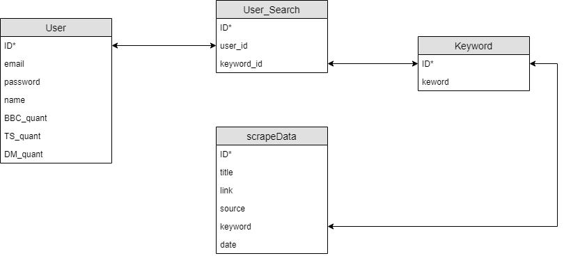
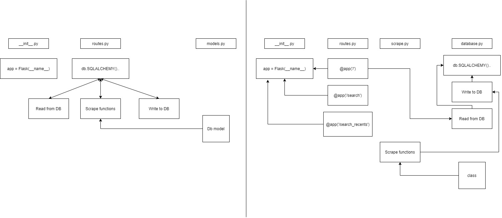

# News Scraper

## MVP
- User authentication - FlaskAuth/flask-login
- Frontend -> Jinji2 Templating/HTML
- Backend -> Flask 
- Scraping from 3 news websites based on keyword 
- DB to store user and article information 

## Technologies
- SQLAlchemy
- Beautiful Soup / Scrappy (Python)
- Flask (Python) 
- Flask_login / Werkzeug_Security
- Bulma

## User stories *(*not implemented*)
- As a user, if I am new to the website, I should be able to sign up
- As a user, if I already have an account, I should be able to log in
- As a user, if I am logged in, I should be able to see my dashboard 
- As a user, when I want to leave the page, I should be able to log out if I was already logged in
- (*As a user, if I forgot my accound credentials, I should be able to retrieve it through email*)
- (*As a user, on my dashboard, I should be able to see my saved search terms as tabs*)
- (*As a user, on my dashboard, I should be able to pin specific search terms onto a UI element*)
- As a user, when I look at the search results, I should be able to tell which source they are from 
- (*As a user, I should be able to see a random article title, which can be refreshed for a new random title* )
- __As a user, I should be able to search for a keyword in the app to return a list of scraped articles from a number of news websites__

## Problems faced / Solutions
- BBC HTML had inconsistencies in their HTML where the first article did not always have title inside the anchor tag
    - We found an article tag which had all the information including the title inside consistently 
- Data Structure: when passing information into the Jinja2 template from database
    - Use list of dictionaries and a for loop to access each one
- Circular Imports
    - Learn how to do imports properly (see diagram below)
- Database Issues
    - Improving database structure as more information is being stored (see diagram below)
- Minor problems with authentication
    - Refactored tutorial code into suitable structure for our application
- Absracting code base
    - split out all database function and helper functions into respective python files, allowing for a cleaner routes.py file

## Initial Planning 
- Stage 1: Get the scraper to scrape
- Stage 2: Disect response to get information that we want (e.g. title, link to article)
- Stage 3: Display scraped bits onto a front end 
- Stage 4: Add user authentication and be able to search on front-end
- Stage 5: Show recent searches and pinned search terms
- Stage 6: Random article 
- Stage 7: Sentiment analysis (Stretch) and insights from it 
- Stage 8: Profile stats (searches, articles read, streaking/ goals) (Stretch) 

## Executed Plan
- Stage 1: As above
- Stage 2: As above
- Stage 3: As above
- Stage 4: Implement more scrapers for Daily Mail and The Sun
- Stage 5: Change database structure to separate information that is being stored
- Stage 6: Implement authentication
- Stage 7: Implement settings: storing, reading, updating functionality
- Stage 8: Join settings rules to searches
- Stage 9: Further refactoring and absracting
- Stage 10: Styling and small bug fixes

## If we had more time...
- More options in the settings, eg change colour theme of dashboard
- Random article from inital planning stage 6
- Sentiment Analysis from stage 7
- Progress tracker for no. of articles visited/searched/overall profile stats
- TESTING
- Bookmarking/tab for favourtie searches
- Catch all error page for incorrect routes
- Change password functionality
- Add more sources to scrape from
- More responsiveness, CSS consistency
- Abstract more
- Set a timer to rescrape already searched keywords
- Limit recents table to last 10 searches or similiar

## Database Architecture
  
Database Structure

  
Dependancies Flow
